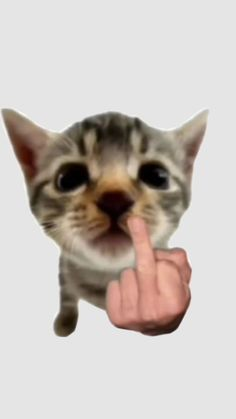

<html lang="es">
<head>
    <meta charset="UTF-8">
    <meta name="viewport" content="width=device-width, initial-scale=1.0">
    <title>Mi Proyecto</title>
    
</head>
<body> 
    <h1>ENTONCES HACEMOS LA PAGINA O MIEDO? </h1>
    

    

        <button>Sí</button>
        <button>No</button>
    

    

        
hola mano, si esta mirando esto es porque puso que si ahora toca crear la pagina y empezar a hacerle, escribame aqui

        
    

    

        
mono marica

        
    

    
</body>
</html>
